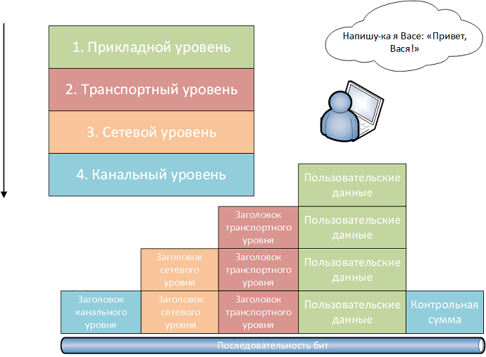

# Теоретические сведения

## Клиент-серверное взаимодействие

Клиент-серверная модель является основой работы веб-приложений. Она распределяет функционал между двумя участниками: клиентом (программа, запрашивающая услугу) и сервером (программа, предоставляющая услугу).

- **Клиент** – это программа, например, браузер, которая отправляет запросы на сервер.
- **Сервер** – программа, которая обрабатывает запросы и отправляет ответ (например, HTTP-сервер Apache, базы данных MySQL).

Они взаимодействуют по сети (например, Интернет) с использованием различных протоколов, таких как HTTP, FTP и IP-протоколы. Каждый протокол выполняет свою задачу, позволяя клиенту отправлять запросы, а серверу отвечать на них.

##### Пример:


При использовании протокола HTTP клиент (браузер) отправляет серверу запрос на получение веб-страницы. Этот запрос называется **HTTP-запросом** и включает метод (например, GET или POST). Сервер, получив запрос, возвращает **HTTP-ответ** с кодом состояния (например, 200 OK, 404 Not Found) и запрашиваемыми данными (например, HTML-страницей).

Основной принцип заключается в том, что клиент инициирует взаимодействие, а сервер только отвечает на запросы. Клиентское ПО и серверное ПО обычно работают на разных устройствах, но могут находиться и на одном компьютере.

## **Модель TCP/IP**
Главной задачей стека TCP/IP является объединение в сеть разнородных пакетных подсетей через шлюзы. Каждая сеть может работать по своим правилам, однако шлюзы принимают пакеты из других сетей и передают их по указанным адресам. Пакеты передаются из одной подсети в другую через последовательность шлюзов, обеспечивающих сквозную маршрутизацию по всей сети. В данном контексте под шлюзом понимается точка соединения сетей, которая может быть как локальной, так и глобальной. В качестве шлюза могут выступать как специализированные устройства (например, маршрутизаторы), так и компьютеры с программным обеспечением для маршрутизации пакетов.

**Маршрутизация** — это процесс определения пути, по которому пакет будет передан из одной сети в другую. Такой механизм доставки возможен благодаря внедрению в узлы сети протокола IP (Internet Protocol). При передаче любое сообщение разделяется на фрагменты, и каждый из этих фрагментов снабжается адресами отправителя и получателя, а также номером в последовательности пакетов. Это позволяет маршрутизаторам на каждом этапе выбирать оптимальный путь для пакета в зависимости от текущего состояния сети, что повышает надежность передачи данных. Важным аспектом является то, что каждый пакет может пройти по своему собственному маршруту, и порядок их прибытия не имеет значения, так как в каждом пакете содержится информация о его положении в сообщении.



**Пример передачи данных**

На рисунке 2 представлен пользователь, который отправляет сообщение «Привет, Вася!». Когда пользователь вводит сообщение в почтовом клиенте и нажимает кнопку «Отправить», сообщение существует в виде пользовательских данных — это самый верхний уровень модели TCP/IP.

На **транспортном уровне** данные делятся на небольшие фрагменты, к каждому из которых добавляется заголовок, чтобы получатель смог собрать сообщение в исходном виде. Транспортный уровень создает надежный виртуальный канал поверх ненадежной сети.

Затем данные спускаются на **сетевой уровень**, где к ним добавляется сетевой заголовок, помогающий маршрутизаторам определить путь передачи данных. На этом уровне формируется логическая топология сети.

После этого данные передаются на **канальный уровень**, где к ним добавляются канальные заголовки, формируя кадры. Канальный уровень управляет физическим доступом к сети и проверяет целостность данных.

Когда кадры сформированы, они преобразуются в последовательность бит и передаются по линии связи — это **физический уровень**.

##### Пример передачи данных:

1. **IP-адрес отправителя:** 82.146.49.55
2. **Порт отправителя:** 2049
3. **IP-адрес получателя:** 195.34.32.116
4. **Порт получателя:** 53 (DNS-сервер)

Пакет отправляется с сокета 82.146.49.55:2049 на сокет 195.34.32.116:53. Сервер по адресу 195.34.32.116 (DNS) обработает запрос и отправит ответ обратно на сокет отправителя.

---

#### Инкапсуляция и декапсуляция данных

Процесс передачи данных делится на несколько этапов. При подготовке к отправке на каждом уровне добавляется заголовок, содержащий служебную информацию (адреса, порты и т.д.). Этот процесс называется **инкапсуляцией**. После получения данных заголовки удаляются на каждом уровне — это **декапсуляция**.

Заголовки содержат информацию о маршрутизации и корректности данных, что помогает сети доставить их по назначению и собрать в правильном порядке.

---

#### DNS и разрешение доменных имен

Людям сложно запоминать IP-адреса (например, 195.34.32.116), поэтому используется система доменных имен (DNS). DNS-сервера преобразуют доменные имена (например, www.example.com) в IP-адреса, что облегчает взаимодействие пользователей с интернет-ресурсами.

##### Пример:

Клиент отправляет запрос на сервер DNS (195.34.32.116:53) с вопросом: **«Какой IP-адрес соответствует домену www.example.com?»**

DNS-сервер отвечает: **«82.146.49.55»**.

Затем клиент устанавливает соединение с веб-сервером по порту 80 и загружает страницу www.example.com.


## **Протокол HTTP**
Протокол HTTP (HyperText Transfer Protocol) — это основа взаимодействия между веб-браузерами и веб-серверами. Когда пользователь вводит URL-адрес в строке браузера, кликает по ссылке или отправляет форму, браузер отправляет на сервер HTTP-запрос.

#### Основные элементы HTTP-запроса:

1. **Метод** — определяет действие, которое нужно выполнить (например, GET, POST).
    - **GET** — запрашивает ресурс (например, HTML-страницу или изображение).
    - **POST** — отправляет данные на сервер (например, для отправки формы).
2. **URL** — определяет путь к ресурсу.
3. **Заголовки** — содержат метаинформацию о запросе (например, тип клиента, кодировки).
4. **Тело запроса** (для методов POST и других) — содержит данные, которые передаются на сервер (например, содержимое формы).

#### HTTP-ответ:

После обработки HTTP-запроса сервер отправляет ответ, который содержит:
1. **Код состояния** — указывает на результат выполнения запроса (например, 200 OK, 404 Not Found).
2. **Заголовки** — метаинформация о содержимом ответа (например, тип данных, длина).
3. **Тело ответа** — содержит данные, запрашиваемые клиентом (например, HTML-код веб-страницы).

#### Пример HTTP-запроса и ответа:

1. **Запрос:**

```
GET /index.html HTTP/1.1
Host: www.example.com
User-Agent: Mozilla/5.0
Accept: text/html
```

2. **Ответ:**

```
HTTP/1.1 200 OK
Content-Type: text/html
Content-Length: 1234

<html>
<head><title>Exa ```
HTTP/1.1 200 OK
Content-Type: text/html
Content-Length: 1234

<html>
<head><title>Example</title></head>
<body>Пример страницы</body>
</html>
```mple</title></head>
<body>Пример страницы</body>
</html>
```

#### Методы HTTP:

- **GET** — запрашивает ресурс.
- **POST** — отправляет данные на сервер.
- **PUT** — обновляет существующий ресурс или создает новый.
- **DELETE** — удаляет указанный ресурс.
- **HEAD** — запрашивает только заголовки, без тела ответа.

### **HTTP-заголовки**
HTTP-заголовки — это метаинформация, передаваемая между клиентом и сервером для управления передачей данных. Заголовки помогают определить параметры соединения, типы данных, методы сжатия и многое другое.

#### Основные виды заголовков:

1. **General Headers** — общие заголовки, применяемые и к запросам, и к ответам:
   - **Connection**: указывает, поддерживать ли соединение (`keep-alive` или `close`).
   - **Date**: дата и время отправки сообщения.

2. **Request Headers** — заголовки, отправляемые клиентом:
   - **Host**: доменное имя сервера (обязательно).
   - **User-Agent**: информация о клиенте (браузере).
   - **Accept**: типы данных, которые клиент может принимать (`text/html`, `application/json`).
   - **Cookie**: отправляет куки на сервер.

3. **Response Headers** — заголовки, отправляемые сервером:
   - **Content-Type**: тип содержимого ответа (например, `text/html`).
   - **Content-Length**: длина тела ответа в байтах.
   - **Set-Cookie**: устанавливает куки для клиента.

#### Пример запроса:

```http
GET /index.html HTTP/1.1
Host: www.example.com
User-Agent: Mozilla/5.0
Accept: text/html
```

#### Пример ответа:

```http
HTTP/1.1 200 OK
Content-Type: text/html; charset=UTF-8
Content-Length: 348
Set-Cookie: sessionid=abc123; HttpOnly
```

Эти заголовки передают ключевую информацию для обработки запроса и ответа между клиентом и сервером.